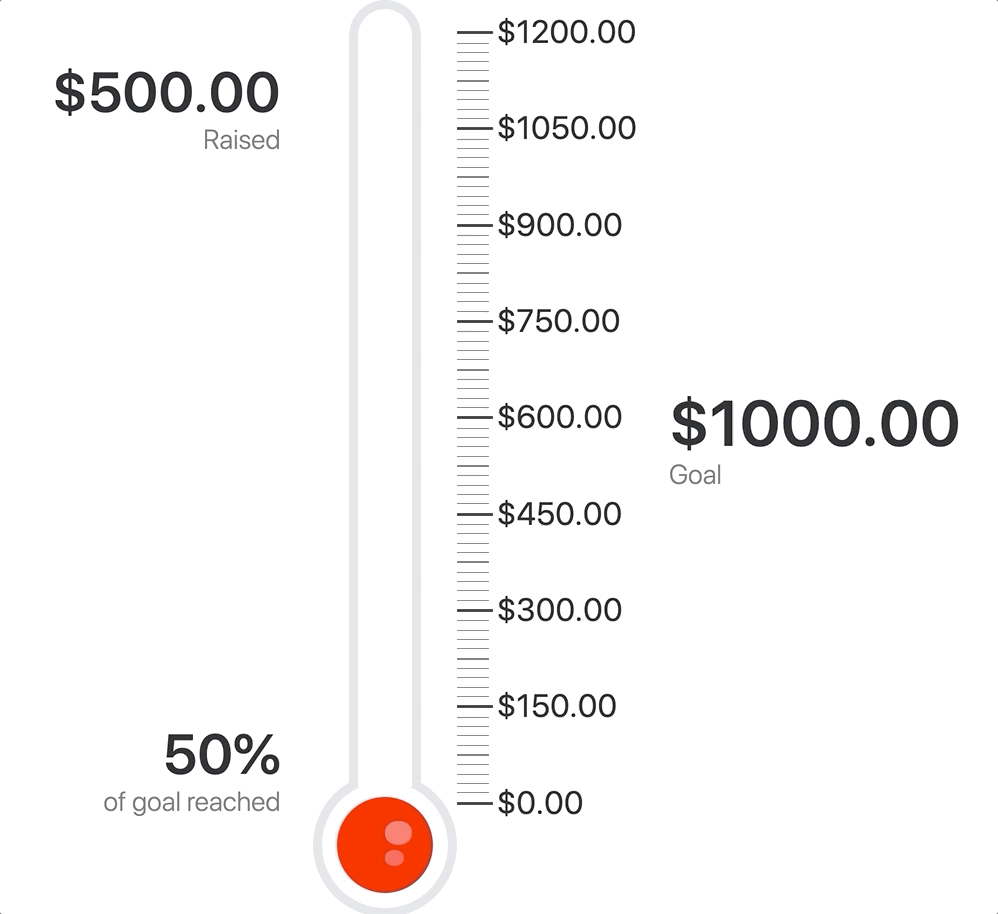

# vue-goal

A Vue component to display fundraising goals with a pure animated HTML/CSS thermometer.

## Installation

    npm install vue-goal --save

## Basic Example

    <!-- in your main.js or equivelent -->
    import { Thermometer } from 'vue-goal';

    Vue.use(Thermometer);

    <!-- in the template... -->
    <thermometer :min="0" :max="1200" :goal="1000" :value="500" :format="value => `$${value}` statistics ticks intervals />
